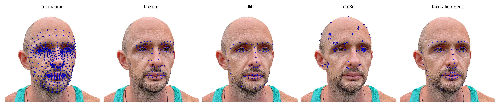

# mvlm - Multi-view 3D Landmarking of facial scans

This tool is a continued development of [Multi-view Consensus CNN for 3D Facial Landmark Placement](https://github.com/RasmusRPaulsen/Deep-MVLM).
We generalized the placing algorithm to be usable with any pre-existing 2D facial landmarking model.
We focused on the tool's usability and simplified the processing pipeline to be more user-friendly, including a significant speed-up in the prediction and render capabilities.
The project has been restructured to be more modular, accessible to extend, and installable as a Python package.

We support the following landmark predictors by default (custom ones can be added or requested):

* Mediapipe
* BU3DFE
* Dlib
* DTU3D
* FaceAlignment


"Head scan 09 (photogrammetry)" (https://skfb.ly/oxGZG) by yaro.pro is licensed under Creative Commons Attribution (http://creativecommons.org/licenses/by/4.0/).

For more examples, please see the papers!

## Citing

As we base our work on the original Deep-MVLM, we kindly ask you to cite the original paper and ours if you use this tool in your research:

```bibtex
--One More Upcoming--

@InProceedings{10.1007/978-3-031-47969-4_10,
  title="From Faces to Volumes - Measuring Volumetric Asymmetry in 3D Facial Palsy Scans",
  author="B{\"u}chner, Tim and Sickert, Sven and Volk, Gerd Fabian and Guntinas-Lichius, Orlando and Denzler, Joachim",
  booktitle="Advances in Visual Computing",
  year="2023",
  publisher="Springer Nature Switzerland",
  address="Cham",
  pages="121--132",
  isbn="978-3-031-47969-4"
}

@InProceedings{paulsen2018multi,
  title={Multi-view Consensus CNN for 3D Facial Landmark Placement},
  author={Paulsen, Rasmus R and Juhl, Kristine Aavild and Haspang, Thilde Marie and Hansen, Thomas and Ganz, Melanie and Einarsson, Gudmundur},
  booktitle={Asian Conference on Computer Vision},
  pages={706--719},
  year={2018},
  organization={Springer}
}
```

## Installation

We recommend a Python virtual environment for the installation.
The following commands will install the package and its dependencies.
Download or clone from Github:

```bash
git clone https://github.com/cvjena/mvlm
cd mvlm
pip install -e .
```

## Getting started

After importing the package, you can use the following code to predict landmarks on a single mesh file.
You must specify the path to the mesh file and the pipeline you want to use.
The pipeline can be instantiated with the `create_pipeline` function or by directly importing the class and creating an instance.
The loading of the model, 3D face scan, and prediction of the landmarks are made in the `predict_one_file` function.
The pipeline only has to be created once for multiple predictions.

```python
from pathlib import Path
import numpy as np
import mvlm

# create the model for predicting the landmarks
# The Pipeline can be any of the following:
# * "Mediapipe"
# * "BU3DFE"
# * "DTU3D"
# * "Dlib"
# * "FaceAlignment"
file = Path("path/to/your/mesh.obj")

dm = mvlm.pipeline.create_pipeline("mediapipe")
landmarks = dm.predict_one_file(file)
np.savetxt((pathToOut / f"{file.stem}.txt").as_posix(), landmarks, delimiter=",")

# if you want to visualize the landmarks on the mesh
# mvlm.utils.VTKViewer(file.as_posix(), landmarks)
```

### Supported facial scan formats

We limited the supported formats to **obj**, and this was the most common format for our use case.
Other formats can be added by request or by extending the code.

* **OBJ** textured surfaces

## License

We use the same license as the original Deep-MVLM.
`mvlm` is released under the MIT license. See the [LICENSE file](LICENSE) for more details.

### Possible Issues

* If you encounter any issues, please open an issue on the Github repository.
* If the tool cannot open a `vtkOpenGLRenderWindow`, you might have to remove the libstc++ package from your conda environment.
  
  ```bash
  cd yourcondapath/env/name/lib/
  mv libstdc++.so.6 libstdc++.so.6.old
  ```
